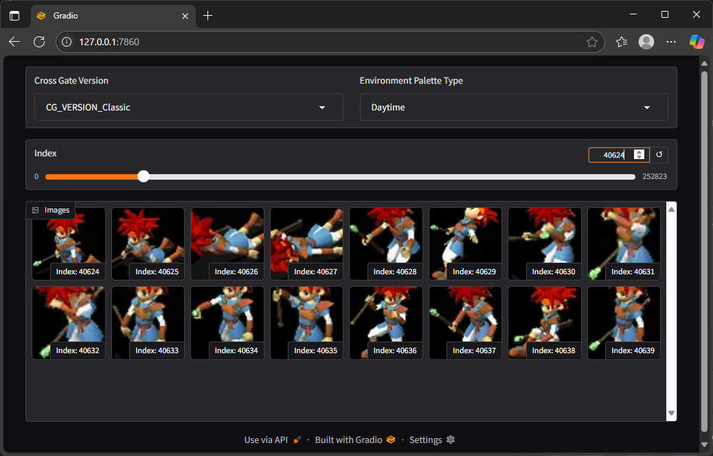

# CrossGate Graphics Data Viewer

A simple Gradio-based web application for previewing graphics data from the classic game Cross Gate using palettes and data provided by the cgl backend module.

This tool is part of the CrossGate-Legacy project and is intended for non-commercial use by fans to explore in-game graphics and palettes.

## Requirements

- Python 3.8+
- gradio >= 3.0 (recommended 5.38.0)
- Compiled cgl.pyd (built with CMake from CrossGate-Legacy project)

    > Make sure cgl module is in build/bin relative to this script.

## How to Run

Run the Python viewer:

    # activate cgl env, see CrossGate-Legacy\README.md
    conda activate cgl
    cd bin/GraphicsDataViewer
    python graphics_data_viewer.py

Open your browser:

    The app will launch at  http://127.0.0.1:7860/  by default.

